# Architecture — Relay Decision Flow

Roles are split across three lanes:

- **Leader** — best-effort early-warning detection only. Publishes `relay_request` when its own GC link degrades; publishes `radio_health` continuously. Never depended on for the decision.
- **GC / Cloud** — primary detection (`gc_link_observer` watches the GC↔leader link from the surviving end) and authorization (`relay_decision_authority`).
- **Follower** — sense → assess → propose → execute → maintain. Hosts the behaviour tree in `capability_assessor`. Runs the actual relay.

Cross-lane invariant: tasking fires on GC observation regardless of `relay_request`. Leader requests *enrich*, they never *trigger*.

## Full flow diagram

```mermaid
%%{init: {'theme':'base', 'flowchart': {'curve':'basis', 'nodeSpacing': 36, 'rankSpacing': 44}, 'themeVariables': {'fontSize':'13px'}}}%%
flowchart TB
    classDef leader fill:#e8f0ff,stroke:#2563eb,color:#0b2a6b,stroke-width:1.5px;
    classDef follower fill:#e3fbf3,stroke:#0d9488,color:#064e43,stroke-width:1.5px;
    classDef gc fill:#fff3dd,stroke:#d97706,color:#6b3d00,stroke-width:1.5px;
    classDef state fill:#f1f5f9,stroke:#94a3b8,color:#334155,stroke-dasharray:4 3;
    classDef gate fill:#eafff8,stroke:#0d9488,color:#064e43,stroke-width:1.5px,stroke-dasharray:5 3;
    classDef forced fill:#fee2e2,stroke:#dc2626,color:#7f1d1d,stroke-width:1.5px;
    classDef vexit fill:#fde68a,stroke:#d97706,color:#78350f,stroke-width:1.5px;
    classDef stay fill:#86efac,stroke:#15803d,color:#14532d,stroke-width:1.5px;
    classDef warn fill:#fed7aa,stroke:#ea580c,color:#7c2d12,stroke-width:1.5px;
    classDef hold fill:#e5e7eb,stroke:#6b7280,color:#1f2937,stroke-dasharray:4 3;
    classDef radio fill:#ede9fe,stroke:#7c3aed,color:#4c1d95,stroke-width:1.5px;
    classDef note fill:#fffbe6,stroke:#ca8a04,color:#713f12,stroke-dasharray:2 2;

    subgraph LEADER["LEADER · drone-01 — DETECT (best-effort early-warning only)"]
        L_sense(["RADIO_STATUS<br/>own GC-link SNR / noise"]):::state
        L_det{"link_detector — best-effort EARLY-WARNING<br/>own GC-link degraded / marginal?<br/>cause-disambiguation (link vs airframe)<br/>NEVER depended upon"}:::leader
        L_req["publish relay_request<br/>(best-effort · enriches GC tasking)"]:::leader
        L_radio["radio_health publisher<br/>leader_severity (own noise floor, this hop only)<br/>+ leader_radio_range_m (own hardware nominal range — published, not config-assumed)<br/>always-on"]:::radio
        L_sense --> L_det
        L_det -->|"no — hold"| L_sense
        L_det -->|"marginal — send early"| L_req
        L_sense --> L_radio
    end

    subgraph GC["GC / CLOUD — DETECT (primary) · DECIDE whether + who · AUTHORIZE"]
        G_obs(["gc_link_observer — PRIMARY DETECTOR<br/>observes GC↔leader from the SURVIVING end<br/>SNR weakening/silent → triggers TASKING<br/>independent of relay_request"]):::gc
        G_task{"relay_decision_authority — TASKING<br/>PRIMARY trigger: GC-side observation (independent)<br/>also: relay_request (enriches) · follower exit/decline (fleet re-eval)<br/>relay warranted? which follower? fleet view: position + battery"}:::gc
        G_drop(["no relay —<br/>keep observing"]):::state
        G_auth{"relay_decision_authority — AUTHORIZE<br/>validates a NEW-relay strategy proposal<br/>mission priority + operator policy (validates, never selects)<br/>echoes authorized R_target back so chain_assigner writes it verbatim"}:::gc
        G_radio["radio_health publisher<br/>gc_severity (own noise floor, this hop only)<br/>+ gc_radio_range_m (own hardware nominal range — published, not config-assumed)<br/>always-on"]:::radio
        G_hier(["detection hierarchy + INVARIANT<br/>L1 GC-side (primary · independent) · L2 leader early-warning (best-effort) · L3 peer courier (best-effort)<br/>INVARIANT: TASKING fires on GC observation regardless of relay_request — request enriches, never triggers"]):::note
        G_obs -->|"weakening / silent → PRIMARY trigger (independent)"| G_task
        G_task -->|no| G_drop
        G_obs --> G_radio
        G_obs -.- G_hier
    end

    subgraph FOLLOWER["FOLLOWER · drone-02 — SENSE · ASSESS · PROPOSE · EXECUTE · MAINTAIN"]
        F_radio(["follower's own radio_health<br/>follower_severity (own noise floor, own physical location)<br/>+ follower_radio_range_m (own hardware nominal range)<br/>IN-PROCESS — same device as BandSensorNode, no DDS hop<br/>NOT the same as follower_signal_faker's per-hop SNR (gate 7) — see note"]):::follower
        F_radio -->|"in-process (blackboard write)"| F_sense

        F_rhguard{"radio_health fresh? — 3rd freshness domain<br/>per-peer max_age · peer-reported<br/>(NOT FCU telemetry · NOT RF link-quality)"}:::follower
        F_rhfall["fallback band inputs<br/>cap → config nominal · severity → conservative floor<br/>band SHRINKS (never inflates) · flag stale_radio_health<br/>DEGRADE not EXIT — measured M_link stays the trigger"]:::warn
        F_sense(["signal_reader / state_bridge<br/>→ blackboard (async, always-on)<br/>holds leader_severity · gc_severity · leader_radio_range_m · gc_radio_range_m (received, not config-assumed)<br/>+ follower_severity · follower_radio_range_m (from F_radio, in-process)<br/>+ gc_cap_m · leader_cap_m · follower_cap_m (BandSensorNode-computed, all 3 — the spine, live or fallback)"]):::state
        F_root{"capability_assessor @0.5Hz<br/>ROOT selector — runs EVERY tick<br/>role?"}:::follower

        F_trig{"RelayRequestReceived?<br/>GC tasking — SOLE relay-assessment entry<br/>(no self-trigger of any kind)"}:::follower
        F_tvalid{"tasking-validity guard<br/>not me as leader?"}:::follower
        F_reject(["reject mis-tasking<br/>(addressed me as relay, but I am leader)<br/>notify GC"]):::state
        F_cap{"capability checks — 'can I execute the tasking?'<br/>battery · GPS · geometry feasible<br/>geofence · return margin"}:::follower
        F_decline(["ProposeLetLeaderIsolate<br/>explicit DECLINE of tasking + reason<br/>(GC decides what happens to the leader)"]):::state
        F_strat["select strategy (action nodes)<br/>Continuous / Chain · reads band sensor R_target<br/>→ pending_proposal (incl. R_target)"]:::follower
        F_eval["relay_strategy_evaluator<br/>enrich + dedupe (bucketed id)<br/>+ target-stability bucket R_target<br/>→ strategy_proposal (incl. bucketed R_target)"]:::follower

        F_assign["chain_assigner — WRITE authorized target (no recompute)<br/>read authorized R_target from authorization payload<br/>write current_relay_target = authorized R_target (verbatim)<br/>compute ETA = estimate_battery_cost(cur, R_target)"]:::follower
        F_exec["strategy_executor (thin)<br/>role → MOVING_TO_RELAY"]:::follower
        F_move{"relay_position_tracker — ARRIVAL + FAULT SURFACE<br/>watches pos vs current_relay_target (read-only · no setpoints)<br/>movement guards: ACK · progressing · mode held · arrived?<br/>publishes position_reached within acceptance radius"}:::follower
        F_relaying(["role = RELAYING"]):::state
        F_mover(["relay_mover — SETPOINT STREAMER (OFFBOARD keepalive owner)<br/>streams current_relay_target @2-5Hz continuously<br/>while MOVING_TO_RELAY or RELAYING · hold = constant setpoint<br/>reads target (never writes) · calls px4_agent.publish_setpoint"]):::state
        F_monitor(["continuous_monitor<br/>sudden SNR event (observability fast-path)"]):::state

        F_gate{{"role gate — re-checked at ROOT each tick<br/>IsAlreadyRelaying ✓  (pass-through)<br/>only an EXIT flips it to IDLE"}}:::gate

        M_FEXIT["FollowerSafetyExit — FORCED (FCU-state only)<br/>own RTL for AIRFRAME safety · alert GC (best-effort)<br/>pending_command → executor direct · role = IDLE<br/>makes NO decision about leader / mission"]:::forced
        M_VEXIT["ProposeExitRelay (with context)<br/>reason · trigger · relay-vs-baseline diagnostic<br/>→ GC TASKING re-eval · role = IDLE<br/>'cannot do the job from here'; GC decides next"]:::vexit
        M_LOSTFC["LOST FC LINK<br/>flag exit intent + alert GC<br/>PX4 onboard failsafe handles airframe<br/>(companion can't command RTL)"]:::forced

        M_fcufresh{"1 · FCU telemetry fresh?<br/>(MAVLink: battery · mode · pos · GPS)"}:::follower
        M_batt{"2 · battery_ok?  (forced safety)"}:::follower
        M_mode{"3 · mode_held?<br/>OFFBOARD retained (HEARTBEAT)"}:::follower
        M_recq{"recover attempts &lt; 3?"}:::follower
        M_recover["RECOVER_OFFBOARD<br/>re-command mode + keep ≥2Hz stream<br/>+ confirm COMMAND_ACK"]:::warn
        M_pos{"4 · pos_ok?<br/>PositionServiceable (geofence / geometry)"}:::follower
        M_fresh{"5 · RF-link telemetry fresh?<br/>(signal only)"}:::follower
        M_staleq{"stale &gt; 5 s timeout?"}:::follower
        M_hold["HOLD<br/>defer · no emit this tick"]:::hold
        M_needed{"6 · still_needed? — DIRECT link<br/>GC↔leader (the link the relay exists for)<br/>recovered &gt; 0.85? (hysteresis)"}:::follower
        M_link{"7 · RelayLinkAdequate? — RELAY HOPS  PRIMARY<br/>GC↔follower &amp; follower↔leader<br/>SNR ≥ MIN_SNR"}:::follower
        M_driftq{"drifted vs band AND<br/>battery allows reposition?<br/>(band = gc_cap · leader_cap · severity)"}:::follower
        M_repos["ProposeReposition<br/>(only if gain ≥ 5 dB justifies the move)"]:::stay
        M_eff{"8 · RelayActuallyImproved? — DIAGNOSTIC<br/>relay path ≥ 3 dB / ≥ 10 pp better<br/>than the DIRECT link (baseline)?"}:::follower
        M_redwarn(["CONTINUE + redundancy advisory<br/>(relay working but maybe unnecessary)"]):::warn
        M_gps{"9 · GPS degraded?"}:::follower
        M_cont_gps(["CONTINUE + GPS alert"]):::warn
        M_cont(["CONTINUE"]):::stay

        F_rhguard -->|"fresh → live cap + severity"| F_sense
        F_rhguard -->|"stale (per peer)"| F_rhfall
        F_rhfall --> F_sense

        F_sense --> F_root
        F_root -->|"IDLE  (NotAlreadyRelaying ✓)"| F_trig
        F_root -->|"RELAYING  (IsAlreadyRelaying ✓)"| F_gate
        F_gate -->|"✓ — arbiter reads ALL gate_results at once, applies priority ↓"| M_fcufresh

        F_trig -->|"tasking arrived"| F_tvalid
        F_tvalid -->|"invalid — I am the leader"| F_reject
        F_tvalid -->|valid| F_cap
        F_cap -->|fail| F_decline
        F_cap -->|pass| F_strat
        F_strat --> F_eval

        F_assign --> F_exec --> F_mover
        F_exec --> F_move
        F_mover -.->|"≥2Hz setpoint stream (px4_agent.publish_setpoint)"| F_move
        F_move -->|"fault → abort"| M_FEXIT
        F_move -->|"arrived → relay_confirmed"| F_relaying
        F_relaying --> F_mover
        F_relaying --> F_monitor
        F_relaying -->|"first maintenance tick"| F_gate
        F_monitor -->|"reeval_trigger (next tick · observability only, BT already ticks)"| F_gate

        F_sense -.->|"band inputs gc_cap · leader_cap · follower_cap (spine, guarded)<br/>→ band sensor computes R_target → strategy proposal"| F_strat
        F_sense -.->|"band geometry per-hop r_G/r_L = min(follower_cap, far_endpoint) each (guarded)"| M_driftq

        M_fcufresh -->|"FCU fresh"| M_batt
        M_fcufresh -->|"FCU stale → lost flight controller"| M_LOSTFC

        M_batt -->|ok| M_mode
        M_batt -->|"critical → airframe safety"| M_FEXIT

        M_mode -->|held| M_pos
        M_mode -->|"OFFBOARD dropped"| M_recq
        M_recq -->|"attempts &lt; 3"| M_recover
        M_recq -->|"3 failed → OFFBOARD unrecoverable"| M_FEXIT

        M_pos -->|serviceable| M_fresh
        M_pos -->|"infeasible"| M_VEXIT

        M_fresh -->|fresh| M_needed
        M_fresh -->|stale| M_staleq
        M_staleq -->|"yes (&gt; 5 s)"| M_FEXIT
        M_staleq -->|"no — within window"| M_hold

        M_needed -->|"direct link recovered → no longer needed"| M_VEXIT
        M_needed -->|"direct link still bad → relay still needed"| M_link

        M_link -->|"hops adequate"| M_eff
        M_link -->|"hops degraded"| M_driftq
        M_driftq -->|"drifted + battery ok"| M_repos
        M_driftq -->|"not drifted → EXIT_INEFFECTIVE (jamming / GC / leader fault)"| M_VEXIT

        M_eff -->|"clearly helping"| M_gps
        M_eff -->|"barely better — possibly redundant"| M_redwarn
        M_redwarn --> M_gps

        M_gps -->|degraded| M_cont_gps
        M_gps -->|ok| M_cont

        M_cont -->|"next tick · +2s"| F_gate
        M_cont_gps -->|"next tick · +2s"| F_gate
        M_hold -->|"next tick · +2s"| F_gate
        M_recover -->|"re-check next tick · +2s"| F_gate
        M_repos -->|"updates current_relay_target · no re-auth · streamer picks it up"| F_mover
        M_repos -->|"stays RELAYING · next tick · +2s"| F_gate
    end

    L_req -.->|"Layer 2: relay_request — best-effort early-warning<br/>ENRICHES, never triggers (MQTT / DDS-peer)"| G_task
    F_sense -.->|"local link readings → detection reports<br/>(never self-entry)"| G_obs

    G_task -->|"relay_tasking → fires<br/>RelayRequestReceived"| F_trig
    F_reject -.->|"mis-tasking notice"| G_task
    F_eval -->|"strategy_proposal (NEW relay · incl. bucketed R_target)"| G_auth
    G_auth -->|"authorization (echoes authorized R_target)"| F_assign

    F_decline -.->|"decline → fleet re-eval (reassign / chain / authorize isolation)"| G_task
    M_VEXIT -.->|"exit proposal → fleet re-eval (reposition / reassign / chain / authorize isolation)"| G_task
    M_redwarn -.->|"redundancy advisory — candidate for reassignment"| G_task

    L_radio -->|"radio_health<br/>leader_severity + leader_radio_range_m<br/>(DDS-peer)"| F_rhguard
    G_radio -->|"radio_health<br/>gc_severity + gc_radio_range_m<br/>(DDS)"| F_rhguard
    F_rhfall -.->|"band on fallback — advise GC (fleet may re-task)"| G_task

    style LEADER fill:#f5f9ff,stroke:#2563eb,color:#0b2a6b
    style FOLLOWER fill:#f3fdfa,stroke:#0d9488,color:#064e43
    style GC fill:#fffaf2,stroke:#d97706,color:#6b3d00
```

## Key design invariants

- **`gc_link_observer` is the primary detector.** Tasking fires on GC-side observation regardless of whether `relay_request` arrived. The leader's early-warning path exists only to shorten the mean time to detection when it works.
- **The follower has one entry point** (`RelayRequestReceived`). No self-trigger. The idle branch only runs after receiving GC tasking.
- **`chain_assigner` writes the authorized `R_target` verbatim.** The authorization payload carries the target; execution layer never recomputes it. This is the "single source of truth" invariant that lets multi-drone chain assignment stay coherent.
- **The BT root selector re-dispatches on role every tick.** Any exit action flips `current_role` back to `IDLE`, which changes the branch on the next tick without a separate reset step.
- **Two exit families** (safety vs viability) have different terminal actions. See the gate table in the top-level README.
